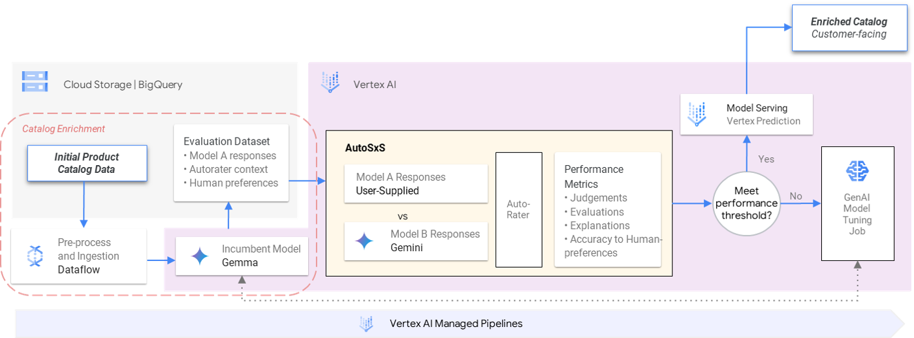
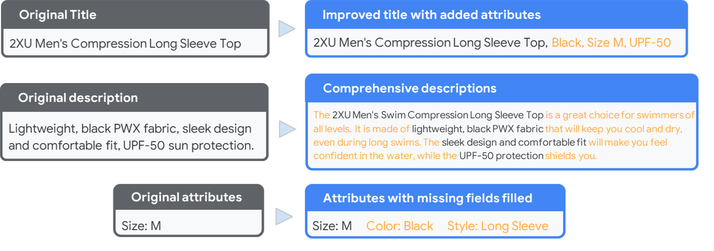
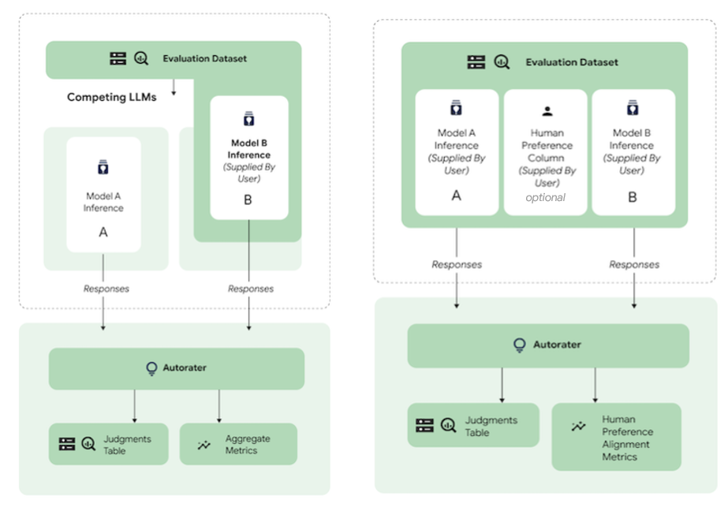

# ds-passage-gen

The content of this repo delves into the practical implementation of enriching product catalog data using Generative AI, a key element for effective product discovery and recommendation systems. There is a strong focus on building a robust and scalable MLOps workflow. We explore the process of automating product description enhancement, leveraging Vertex AI's suite of services including model comparison tooling. 

## Getting started

Once the prerequisites have been met and the user parameters are specified, users can follow the notebook to run through the guided steps.

### Notebooks

Each notebook is self-contained and can be run independently.

* [01-passage_gen_enrichment_eval.ipynb](./01-passage_gen_enrichment_eval.ipynb) : This notebook explores product description enhancement using the open-source GenAI model, Gemma, and evaluates its performance against Google's base models like PaLM as well as with human-alignment preferences.
* [02-passage_gen_pipeline.ipynb](./02-passage_gen_pipeline.ipynb) : This notebook demonstrates an automated MLOps workflow within Vertex AI Pipelines, where evaluation results from AutoSxS trigger downstream actions like model tuning and data logging.
* [model_garden_gemma_finetuning_on_vertex.ipynb](https://github.com/GoogleCloudPlatform/vertex-ai-samples/blob/main/notebooks/community/model_garden/model_garden_gemma_finetuning_on_vertex.ipynb): Reference notebook from the Google Cloud Repoistory that demonstrates finetuning and deploying Gemma models with Vertex AI Custom Training Job

### Prerequisites

Ensure the project environment, network settings, and service accounts used have the appropriate google cloud authentication and permissions to access the folloiwng services:
- `Vertex AI`
- `Artifact Registry`
- `Cloud Storage`

## Workflow

This MLOps workflow showcases the continuous improvement of product data enrichment using Generative AI. Vertex AI Pipelines orchestrates data preprocessing, description generation, automated evaluation with AutoSxS, and performance analysis. Based on the results, the system triggers either deployment of the enhanced catalog or a model tuning job

## Key Concepts

### Product Catalog Enrichment & Merchandising Operations

Generative AI offers an avenue for enhancing product data and improving the way businesses approach merchandising operations and personalization. By leveraging existing catalog information to enrich product data such as descriptions, titles, and attributes, GenAI improves product discoverability, customer experience, and overall shopability in an automated and scalable way.

### Model side-by-side Evaluation using AutoSxS

AutoSxS is a tool within Vertex AI that automatically evaluates the performance of language models, including both Vertex AI models and external ones. It uses a specialized "autorater" model to judge which model provides better responses to prompts, offering an efficient and human-like evaluation process.

This repo utilizes two comparison use-cases:

* Predictions to models
* Predictions with human preferences 

## Future Work

* Creation and integration of model tuning kubeflow components as part of the Passage Generation Managed Pipeline.

## References

* [AutoSxS documentation](https://cloud.google.com/vertex-ai/generative-ai/docs/models/side-by-side-eval)
* [Reference Enrichment using FeedGen: Optimise Shopping feeds with Generative AI](https://github.com/google-marketing-solutions/feedgen)
